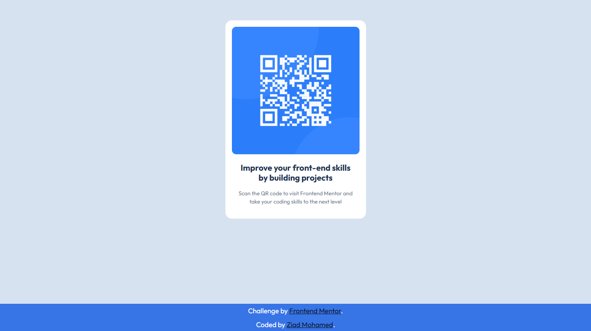

# 📱 QR Code Component

  

A responsive QR code card built with HTML and CSS as part of a Frontend Mentor challenge.

## 📖 About the Challenge

This project is a solution to a Frontend Mentor challenge focused on recreating a clean and responsive QR code card from a provided design.

## ✨ Highlights

- 📱 Responsive card layout.
- 🧱 Semantic HTML structure.
- 🎨 Clean spacing and typography.
- 📐 Simple and maintainable CSS.

## 🛠️ Built With

  

## 💡 Key Takeaways

Throughout this project, I:

- Reinforced my HTML and CSS fundamentals.
- Practiced building a clean card layout from a design.
- Focused on writing simple and maintainable code.
- Improved my confidence by completing the challenge efficiently.

## 🔗 Links

- 🌐 **Live Site:** https://frontend-mentor-qr-code-component-vert.vercel.app/
- 💻 **Repository:** https://github.com/Ziad-mo205/Frontend-Mentor---QR-Code-Component
- 🎯 **Frontend Mentor Solution:** https://www.frontendmentor.io/solutions/semantic-qr-code-component-page-zSptgZ9v1I